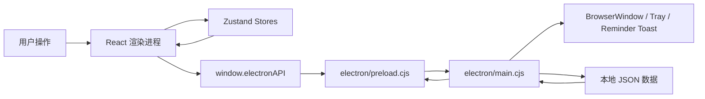

# OKNote 项目导览

这份文档从代码视角整理 OKNote 的结构、运行链路和常见修改入口，帮助你在阅读源码时更快建立地图感。README 更偏产品功能说明；本文更偏“这个项目是怎么实现的、改功能该从哪里下手”。

## 1. 项目一句话

OKNote 是一个基于 Electron + React + TypeScript 的 Windows 桌面备忘录应用。它把日历事件、独立便签、视图便签、每日待办、标签管理和系统托盘整合到一个本地应用里，所有数据都保存为本机 JSON 文件。

核心分工：

- Electron 主进程：创建窗口、托盘菜单、窗口拖拽/贴边收起、提醒弹窗、IPC、数据读写。
- React 渲染进程：日历 UI、便签 UI、设置 UI、Zustand 状态、事件和便签交互。
- 本地 JSON：持久化设置、事件、标签、便签、窗口位置、提醒状态等。

## 2. 技术栈

| 层级 | 技术 |
| --- | --- |
| 桌面壳 | Electron 41 |
| 前端框架 | React 18 + TypeScript |
| 构建工具 | Vite 6 |
| 状态管理 | Zustand |
| 样式 | Tailwind CSS + CSS Variables |
| 动画 | Framer Motion + CSS transition |
| 图标 | lucide-react |
| 日期处理 | date-fns |
| UI 基元 | Radix Slot / Tooltip |
| 打包 | electron-builder + NSIS |

## 3. 启动和构建命令

常用命令定义在 `package.json`：

| 命令 | 作用 |
| --- | --- |
| `npm run dev` | 只启动 Vite，适合看渲染层 UI，但没有完整 Electron 能力 |
| `npm run electron:dev` | 启动 Vite 后再启动 Electron，是主要开发入口 |
| `npm run lint` | 执行 `tsc --noEmit` 做类型检查 |
| `npm run build` | TypeScript 构建 + Vite 构建 |
| `npm run electron:preview` | 构建后用 Electron 预览 |
| `npm run electron:build` | 打包 Windows 安装程序，输出到 `release/` |

Electron 开发模式固定使用 Vite 端口 `5199`，启动前会执行 `scripts/killport.cjs` 清理端口。

## 4. 顶层目录

```text
OKNote/
├─ electron/
│  ├─ main.cjs          # Electron 主进程，项目的桌面集成核心
│  └─ preload.cjs       # 安全暴露 window.electronAPI 给 React
├─ src/
│  ├─ App.tsx           # 根据 hash 分发 calendar / note / settings 窗口
│  ├─ main.tsx          # React 入口
│  ├─ index.css         # Tailwind、主题变量、窗口样式
│  ├─ components/       # 日历、便签、设置、挂载区等 UI
│  ├─ hooks/            # 设置同步 hook
│  ├─ lib/              # 工具函数、节假日、农历、循环事件展开
│  ├─ stores/           # Zustand 状态
│  └─ types/            # 数据类型和 Electron API 类型声明
├─ scripts/             # 开发/打包辅助脚本
├─ assets/              # README 截图
└─ package.json
```

## 5. 整体架构



重要理解点：

- React 不能直接访问 Node 文件系统，而是通过 preload 暴露的 `window.electronAPI` 调主进程。
- Zustand store 负责渲染层内的即时状态，同时在变更后调用 `saveAppData` 等 API 落盘。
- 多窗口同步主要靠主进程广播 IPC，例如 `events-changed`、`tags-changed`、`notes-changed`、`settings-changed`。

## 6. Electron 主进程

主进程文件是 `electron/main.cjs`，它承担的职责非常集中：

| 职责 | 关键位置/概念 |
| --- | --- |
| 数据目录解析和迁移 | `resolveUserDataDir`、`migrateUserData` |
| JSON 读写 | `saveAppData`、`loadAppData`、`deleteAppData`、`listAppData` |
| 窗口注册表 | `winRegistry = { calendar, notes, settings }` |
| 日历窗口 | `createCalendarWindow` |
| 便签窗口 | `createNoteWindow` |
| 设置窗口 | `createSettingsWindow` |
| 托盘菜单 | `createTray` |
| 贴边自动收起 | `checkEdgeAutoHide`、`collapseCalendar`、`expandCalendar` |
| 便签挂载/拖拽 | `dock-note`、`undock-note`、`begin-note-window-drag` 等 IPC |
| 事件提醒 | `startReminderScheduler`、`checkEventReminders`、`showReminderToast` |
| IPC 注册 | `setupIPC` |

应用启动入口在 `app.whenReady()`：

1. 设置 `userData` 目录。
2. 加载设置和窗口位置。
3. 注册 IPC。
4. 创建托盘。
5. 创建日历窗口。
6. 启动事件提醒定时器。

## 7. Preload API

`electron/preload.cjs` 通过 `contextBridge.exposeInMainWorld` 暴露 `window.electronAPI`。对应类型写在 `src/types/electron.d.ts`。

常见 API 分组：

| 分组 | 例子 |
| --- | --- |
| 设置 | `getSettings`、`setSetting`、`onSettingsChanged` |
| 窗口 | `closeWindow`、`hideNote`、`openSettings` |
| 数据 | `saveAppData`、`loadAppData`、`deleteAppData`、`listAppData` |
| 便签 | `createNote`、`showNote`、`deleteNote`、`restoreNotes` |
| 标签 | `getTags`、`saveTag`、`deleteTag`、`onTagsChanged` |
| 事件 | `notifyEventsChanged`、`onEventsChanged`、`createEventFromEcho` |
| 挂载 | `dockNote`、`undockNote`、`beginNoteWindowDrag` |
| 日历 | `onToggleCollapse`、`notifyCalendarHeight` |

如果你新增主进程能力，通常需要同时改三处：

1. `electron/main.cjs` 注册 IPC。
2. `electron/preload.cjs` 暴露 API。
3. `src/types/electron.d.ts` 补类型。

## 8. React 窗口路由

`src/App.tsx` 不使用传统路由库，而是直接读取 `window.location.hash`：

| Hash | 渲染组件 |
| --- | --- |
| `#/calendar` | `CalendarWindow` |
| `#/note/:noteId` | `NoteWindow` |
| `#/note/:noteId/new` | 新建便签窗口 |
| `#/settings` | `SettingsWindow` |

主进程创建窗口时通过 `makeWidgetURL(hash)` 给每个 BrowserWindow 加不同 hash，因此同一个前端包可以承载多类窗口。

## 9. 状态管理

Zustand store 位于 `src/stores/`。

| Store | 主要职责 |
| --- | --- |
| `app.store.ts` | 全局数据是否加载完成 |
| `calendar.store.ts` | 当前日期、事件列表、事件编辑弹窗、标签筛选、循环事件查询 |
| `notes.store.ts` | 便签列表、待办项、倒计时、按便签文件保存 |
| `tag.store.ts` | 标签列表、新增/编辑/删除标签 |

保存策略：

- 事件：`calendar.store.ts` 中变更后防抖保存到 `events.json`，并通知 `events-changed`。
- 便签：`notes.store.ts` 中按单个 `note_{id}.json` 防抖保存。
- 标签：`tag.store.ts` 中防抖保存 `tags.json`，并通知 `tags-changed`。
- 删除标签时还会调用主进程 `deleteTag`，把事件里的标签引用级联清理。

## 10. 主要窗口组件

### 日历窗口

入口：`src/components/windows/CalendarWindow.tsx`

它负责：

- 加载事件、便签、倒计时、标签。
- 恢复未挂载便签窗口。
- 自动创建默认视图便签。
- 处理月/周视图切换。
- 响应主进程动作，例如新建事件、贴边收起、事件编辑。
- 管理日历下方挂载区高度。

日历主体由 `src/components/calendar/MonthGrid.tsx` 渲染。`MonthGrid` 会：

- 根据当前日期生成月视图或周视图日期格。
- 调用 `buildEventsByDate` 展开循环事件和跨日事件。
- 统计每日待办未完成数量。
- 为跨日事件分配行位置，避免同周内显示跳动。

### 便签窗口

入口：`src/components/windows/NoteWindow.tsx`

便签有四种类型：

| 类型 | 含义 |
| --- | --- |
| `independent` | 独立待办便签 |
| `echo` | 按标签回显事件的视图便签 |
| `view` | 默认内置视图便签，主要挂载在日历区域 |
| `daily` | 每日待办便签 |

便签窗口负责：

- 从 `note_{id}.json` 加载单张便签。
- 新建便签时初始化默认数据。
- 修改标题、颜色、待办。
- 独立便签和日历挂载区之间拖拽。
- echo 便签中快速新建或编辑事件。
- daily 便签中按日期管理待办。

### 设置窗口

入口：`src/components/windows/SettingsWindow.tsx`

设置窗口包含：

- 全局主题、字体、字号、开机自启。
- 日历外观。
- 便签外观。
- 便签管理：显示、隐藏、删除。
- 标签管理：新增、编辑、删除事件标签。

设置同步由 `src/hooks/useAppSettings.ts` 和主进程的 `settings-changed` 广播配合完成。

## 11. 事件系统

事件类型定义在 `src/types/calendar.types.ts`。

重要字段：

- `startDate` / `endDate`：日期范围。
- `startTime` / `endTime`：时间段。
- `isAllDay`：全天事件。
- `tagId`：分类标签。
- `recurrence`：循环规则。
- `reminder`：提醒设置。
- `occurrenceKey` / `seriesId` / `occurrenceDate`：循环事件展开后的实例字段。

循环事件展开逻辑主要在 `src/lib/utils.ts`：

- `expandEventsInRange(events, rangeStart, rangeEnd)`
- `buildEventsByDate(events, rangeStart, rangeEnd)`
- `filterEventsByDate(events, dateStr)`

主进程也复制了一套循环展开逻辑，用于事件提醒扫描。这意味着如果以后调整循环规则，最好同时检查渲染层和主进程两份实现，避免显示和提醒不一致。

## 12. 数据存储

主进程会解析最终数据目录：

- 开发/普通 Electron `userData`。
- 打包后安装目录下的 `user-data`。
- 环境变量 `OKNOTE_DATA_DIR` 指定目录。

主要 JSON 文件：

| 文件 | 内容 |
| --- | --- |
| `settings.json` | 全局和窗口外观设置 |
| `data/events.json` | 日历事件 |
| `data/tags.json` | 标签 |
| `data/note_{id}.json` | 单张便签 |
| `data/countdowns.json` | 倒计时 |
| `window-bounds.json` | 窗口位置和大小 |
| `data/reminder-state.json` | 已触发提醒记录 |

注意：渲染层调用 `saveAppData('events', data)` 时，主进程实际会保存为 `data/events.json`。

## 13. 常见开发任务入口

| 想改的功能 | 优先阅读 |
| --- | --- |
| 新增日历事件字段 | `calendar.types.ts`、`EventForm.tsx`、`calendar.store.ts`、`main.cjs` 提醒/IPC |
| 修改事件在日期格里的显示 | `MonthGrid.tsx`、`DayCell.tsx`、`utils.ts` |
| 修改循环事件规则 | `utils.ts`、`electron/main.cjs` 中提醒用的循环展开 |
| 修改事件提醒 | `electron/main.cjs` 的 reminder 区域、`EventForm.tsx` |
| 新增便签类型 | `notes.types.ts`、`createInitialNote`、`NoteWindow.tsx`、`normalizeNote`、设置管理页 |
| 修改便签挂载体验 | `NoteWindow.tsx`、`DockArea.tsx`、`DockedNotesCarousel.tsx`、主进程 dock IPC |
| 修改设置项 | `electron/main.cjs` 默认设置、`SettingsWindow.tsx`、`useAppSettings.ts`、`electron.d.ts` |
| 修改标签逻辑 | `tag.store.ts`、`SettingsWindow.tsx`、`EventForm.tsx`、`main.cjs` tag IPC |
| 修改窗口尺寸/位置 | `electron/main.cjs` 的窗口创建、bounds 保存和 visible 修正 |
| 修改托盘菜单 | `electron/main.cjs` 的 `createTray` |

## 14. 阅读源码建议

建议按这个顺序读：

1. `package.json`：先知道怎么运行。
2. `electron/main.cjs` 顶部到 `createCalendarWindow`：理解桌面壳和窗口创建。
3. `electron/preload.cjs` + `src/types/electron.d.ts`：理解前后端通信边界。
4. `src/App.tsx`：理解 hash 如何分发窗口。
5. `src/components/windows/CalendarWindow.tsx`：理解应用启动后的数据加载主流程。
6. `src/stores/*.ts`：理解状态和持久化。
7. `src/lib/utils.ts`：理解循环事件、日期、颜色和便签归一化。
8. 根据目标功能深入具体组件。

## 15. 容易踩坑的点

- `noteType` 有 `view` 和 `echo` 两种容易混淆的视图类便签：`view` 是默认挂载视图，`echo` 是按标签回显事件的便签。
- 事件循环展开在渲染层和主进程各有一份，改规则时要双边同步。
- 大量保存是防抖的，调试“为什么文件没立刻变”时要等约 300ms。
- 设置窗口会用 `dirtyRef` 避免用户编辑时被外部广播覆盖。
- Electron 窗口拖拽不是靠系统标题栏，而是主进程和渲染层手动配合，改拖拽时要同时看 `NoteWindow.tsx` 和主进程相关 IPC。
- 日历窗口是透明/半透明窗口，很多文字颜色会根据背景亮度动态计算，改样式时要留意可读性函数。
- 主进程直接操作本地 JSON，数据结构变更时最好在 `normalizeNote` 或加载处提供兼容逻辑。

## 16. 快速心智模型

可以把 OKNote 想成三层：

1. **窗口层**：Electron 管窗口、托盘、提醒、拖拽、数据文件。
2. **应用层**：React 窗口组件负责用户交互和视图组织。
3. **数据层**：Zustand 管内存状态，主进程管 JSON 持久化，多窗口靠 IPC 广播同步。

只要记住“React 改状态，store 触发保存，主进程落盘并广播，其他窗口再重载/同步”，大多数功能链路就能串起来。
