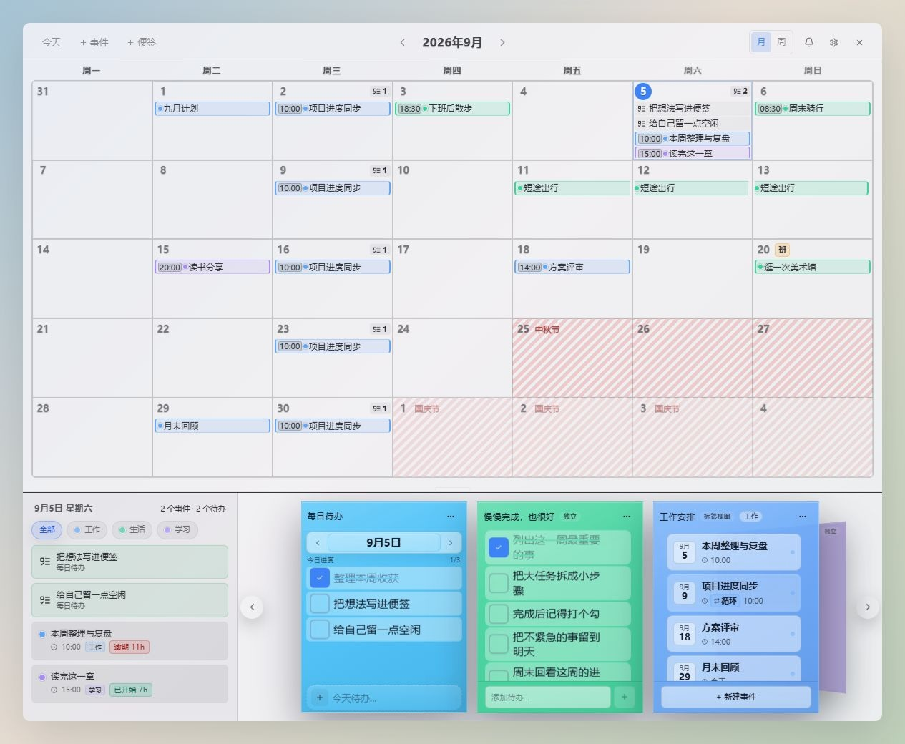
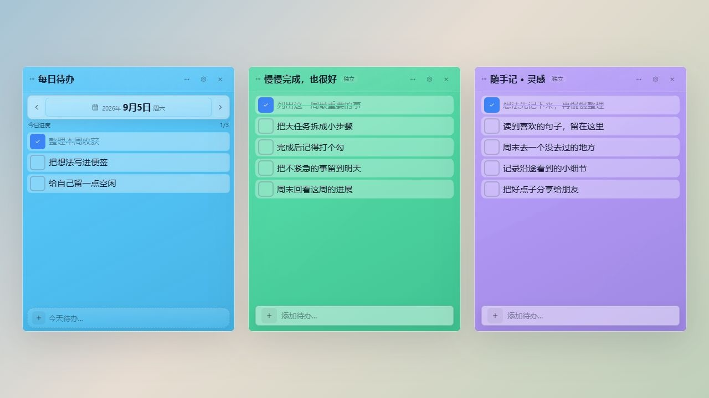
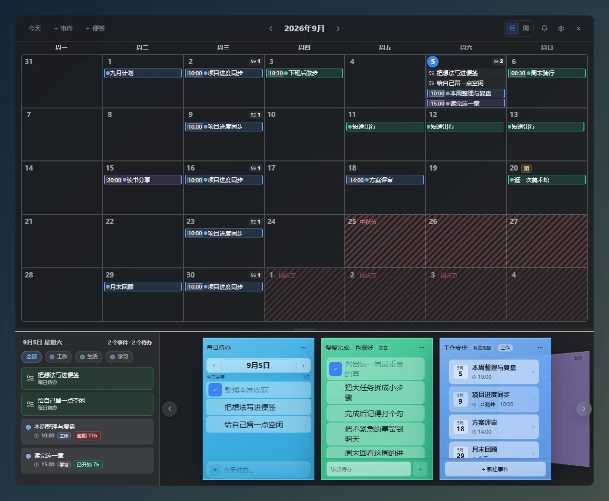
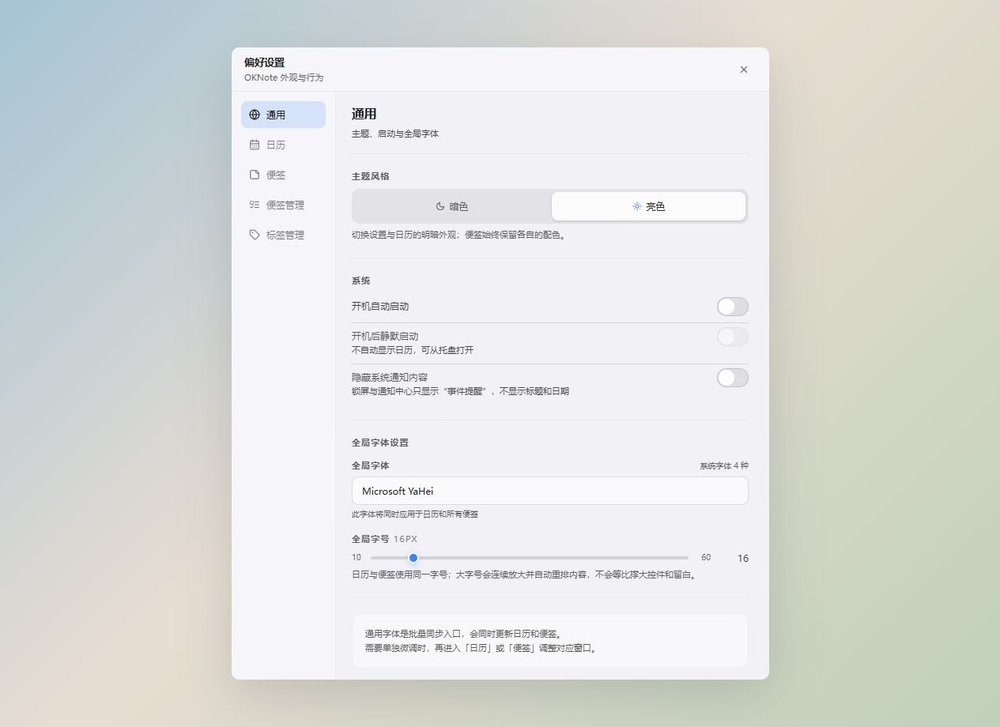

# OKNote

OKNote 是一款 Windows 桌面日历与便签应用，支持日程安排、待办清单和日常记录。半透明窗口可按喜好调整配色，便签既可独立摆放，也可挂载到日历下方，通过立体轮播集中浏览。

## 界面预览

截图在浏览器中拍摄，内容和背景均为演示用。桌面版的半透明效果会随你的壁纸和透明度设置变化。

### 日历与挂载便签



### 每日待办与独立便签



<details>
<summary>查看暗色日历和设置窗口</summary>





</details>

## 功能特性

### 日历

- **月/周视图**：以周一为起始日，支持月视图、周视图、月份前后切换和年月快速跳转。
- **事件管理**：支持单日事件、跨日事件、时间段、全天事件、备注和删除。
- **循环事件**：支持按天、按周、按月、按年循环，可设置间隔、星期、月内日期和结束日期，并会在月视图、周视图、固定区和视图便签中展开显示。
- **事件提醒**：支持准时、提前分钟/小时/天提醒，可选提示音；优先使用系统通知，并保留可查看、可标记已读的提醒记录。可在设置中隐藏锁屏/通知中心里的事件标题与日期。
- **事件标签**：可在设置中维护标签名称和颜色，日历、固定区和视图便签会同步使用标签。
- **文字颜色**：根据背景自动调整事件文字颜色，也可以在设置中自行指定。
- **中国法定节假日**：2024–2026 年按已发布的国务院办公厅通知标注放假与调休；1900–2100 年的其他年份只显示可可靠计算的节日当天，不猜测尚未公布的连休安排。
- **农历日期**：内置 1900-2100 年农历换算，用于春节、端午、中秋等节日计算。
- **每日待办标记**：待办使用清单图标，与事件色条区分显示。日期格右上角标出手工待办与循环事件实例的未完成数量，点击可打开对应日期的每日待办便签。
- **字号调整**：支持 10–60 的字号。大字号时会调整排版，日历中放不下的内容可以滚动查看。
- **贴边自动收起**：把日历移到屏幕边缘可以自动收起，鼠标移过去时展开。
- **可调挂载区**：拖动日历下方的分隔条可以调整高度，重启后仍会保留。也可以在设置中隐藏这块区域，只显示日历。

### 便签

- **独立便签**：每张便签都是独立透明窗口，可在桌面自由拖动，并可编辑标题、颜色和待办；全局不透明度在设置中统一调整。
- **视图便签**：创建时必须绑定标签，按指定标签回显日历事件，并支持从便签中新增、编辑和删除对应事件；同一标签只保留一个视图便签。
- **每日待办便签**：全局只保留一张，提供按日期切换的待办面板；循环事件会同步到每次发生日并可逐次完成，同时支持前后日期、回到今天、手动输入日期、当日进度和历史未完成提示。
- **日历挂载**：便签可拖入日历下方挂载区，变成日历的一部分；隐藏后重新显示会保留挂载状态。
- **当日事件**：日历左下显示当天事件，并支持按标签筛选。
- **立体轮播**：挂载便签较多时，下方区域以正面便签 + 左右倾斜便签呈现，可左右切换并带移动动画。
- **待办清单**：点击文字编辑，完成后勾选；删除的待办可以撤销。
- **便签配色**：每张便签可以单独选颜色，切换日历主题不会改变便签配色。

### 设置与管理

- **外观设置**：可选择浅色或深色主题，调整字体、字号、日历背景和文字颜色、窗口透明度。日历和便签也可以分别设置。
- **便签管理**：集中查看所有便签，支持显示、隐藏、整理桌面位置和移入回收站；回收站中的便签可以恢复或永久删除。
- **标签管理**：维护事件标签，标签删除后会同步清理事件引用。
- **窗口优先级**：设置窗口始终显示在日历与便签窗口之上。
- **开机自启**：可配置随系统启动，并可选择开机后静默启动。

### 系统集成

- **系统托盘**：常驻托盘图标，右键菜单支持新建便签、新建事件、显示/隐藏日历、整理便签、打开设置和退出。
- **窗口记忆**：重启后保留便签的位置、大小、透明度和挂载状态，以及日历挂载区的高度。
- **窗口位置恢复**：更换分辨率或显示器后，会把屏幕外的窗口移回可见位置。
- **安装位置**：Windows 安装程序支持由用户选择程序安装目录。
- **本地保存**：日程、便签和设置保存在当前 Windows 用户的数据目录中，与程序安装目录分开。
- **旧数据兼容**：升级后可以继续使用原有数据。读取失败时会提示并保留文件，不会直接清空。

## 构建

- `npm run electron:build` 构建 Windows 安装程序并输出到 `release/<当前版本>/`。

## 技术栈

| 类别 | 技术 |
| --- | --- |
| 框架 | React 18 + TypeScript |
| 构建 | Vite 6 |
| 桌面 | Electron 41 |
| 状态管理 | Zustand 5 |
| 样式 | Tailwind CSS 3 + CSS Variables |
| 动画 | Framer Motion 11 + CSS transition |
| 图标 | Lucide React |
| 日期处理 | date-fns 4 |
| UI 基元 | Radix UI Tooltip / Slot |
| 打包 | electron-builder NSIS |

## 快速开始

### 环境要求

- Node.js >= 22.12（Electron 安装包构建依赖此版本或更新版本）
- npm >= 9
- Windows 10 / 11

### 安装与运行

```bash
git clone https://github.com/Zhujunjiforyou/OKNote.git
cd OKNote

npm install

# 浏览器预览，修改不会保存到本地文件
npm run dev

# Electron 桌面开发模式
npm run electron:dev

# 预览构建产物
npm run electron:preview

# 打包 Windows 安装程序，输出到 release/<当前版本>/
npm run electron:build
```

常用检查命令：

```bash
npm run lint
npm test
npm run build
node --check electron/main.cjs
```

## 使用指南

### 日历窗口

| 操作 | 方式 |
| --- | --- |
| 切换月份 | 点击标题栏左右箭头 |
| 快速跳转 | 点击标题栏中间的年月 |
| 回到今天 | 点击「今天」 |
| 新建事件 | 点击「+ 事件」，或在日期格右键选择 |
| 查看当天事件 | 双击日期格 |
| 编辑/删除事件 | 点击事件后在详情或编辑面板中操作 |
| 调整挂载区高度 | 拖动日历与下方区域之间的小横条 |
| 切换月/周视图 | 右上角「月 / 周」切换 |

### 便签窗口

| 操作 | 方式 |
| --- | --- |
| 新建独立便签 | 托盘菜单或日历「+ 便签」菜单 |
| 新建视图便签 | 日历「+ 便签」菜单中选择标签 |
| 编辑标题 | 双击便签标题 |
| 添加待办 | 独立便签底部输入内容后回车 |
| 编辑事件 | 在视图便签中点击事件，打开外部编辑面板 |
| 挂载到日历 | 将独立便签拖到日历右下挂载区域 |
| 取消挂载 | 在挂载便签菜单中选择取消挂载 |
| 隐藏/显示 | 通过便签菜单或设置页便签管理操作 |

### 设置窗口

| 标签页 | 功能 |
| --- | --- |
| 通用 | 主题、开机自启、全局字体和字号 |
| 日历 | 贴边自动收起、底部区域显隐、字体、字号、背景、透明度、文字和预览 |
| 便签 | 便签字体、字号和整体不透明度；单张便签颜色在便签菜单中调整 |
| 便签管理 | 便签显示/隐藏/整理/移入回收站，以及恢复和永久删除 |
| 标签管理 | 新增、编辑、删除事件标签 |

## 开发与测试

使用 Node.js 22.12+（推荐 Node.js 24）安装完整依赖后运行：

```bash
npm ci
npm run lint
npm test
npm run build
npm run test:electron-smoke
npm run test:electron-e2e
npm run test:electron-qa
npm run test:electron-upgrade -- --plain
npm run test:electron-upgrade
npm audit --registry=https://registry.npmjs.org
```

`test:electron-e2e` 检查损坏文件、备份恢复和保存失败等情况；`test:electron-qa` 检查日历、便签、设置等常用操作，以及重启后数据是否保留。测试使用临时数据目录，不读取你的便签。运行时会打开测试窗口，请不要同时操作这些窗口。

`test:electron-upgrade` 检查旧数据能否读取、编辑并在重启后保留；`--plain` 使用普通 JSON 样本。测试安装包中的程序时，将 `OKNOTE_ELECTRON_EXECUTABLE` 指向其 EXE，`OKNOTE_LEGACY_FIXTURE_ELECTRON` 指向 Electron 运行时。也可以通过 `OKNOTE_UPGRADE_SOURCE_PROFILE` 指定旧数据目录，测试只操作它的临时副本。

安装保护测试使用 `npm run test:installer-upgrade`，需要先将 `OKNOTE_MAKENSIS` 设置为本地 `makensis.exe` 的完整路径；它使用独立临时目录和测试注册表项，不操作真实安装。

`OKNOTE_ELECTRON_EXECUTABLE` 可指定已有 Electron 可执行文件。`OKNOTE_QA_KEEP_OPEN=1` 仅供原生手工检查，会保留测试进程和临时目录；正常测试不设置它。`lint` 当前仍是 TypeScript 检查，不等同于 ESLint。

多屏、不同缩放比例、睡眠唤醒、开机自启和系统通知还需要在实际 Windows 环境中检查，自动化测试不能替代这些检查。

## 项目结构

```text
OKNote/
├─ electron/
│  ├─ main.cjs                  # Electron 主进程：窗口、托盘、IPC、持久化、贴边收起
│  ├─ preload.cjs               # 暴露安全的 Electron API 给渲染进程
│  ├─ reminder-preload.cjs      # 轻量提醒窗口的受限 API
│  ├─ json-store.cjs            # 原子写入、备份回读与只读保护
│  ├─ data-validation.cjs       # 兼容旧版的业务数据校验
│  ├─ user-data-migration.cjs   # 旧目录迁移与重复导入保护
│  ├─ settings-rules.cjs        # 设置归一化与输入规则
│  ├─ reminder-data.cjs         # 提醒数据规范化与到期范围计算
│  └─ tidy-layout.cjs           # 多屏桌面便签整理算法
├─ build/
│  └─ preserve-user-data.nsh    # 安装阶段的旧数据保护
├─ scripts/
│  ├─ afterPack.cjs             # 检查运行资源并清理未使用的语言包
│  ├─ electron-*-qa.cjs         # 功能与旧数据升级回归
│  └─ lib/                     # Electron 测试驱动和隔离样本
├─ src/
│  ├─ App.tsx                   # Hash 路由分发：calendar、note、settings
│  ├─ main.tsx                  # React 入口
│  ├─ index.css                 # Tailwind、全局变量、窗口和挂载区样式
│  ├─ components/
│  │  ├─ calendar/              # 日历网格、事件表单、事件详情
│  │  ├─ dock/                  # 日历下方固定区、挂载区、便签轮播
│  │  ├─ notes/                 # 待办项、视图事件列表、快速事件表单
│  │  ├─ settings/              # 外观设置、全局字体与共享字体选择器
│  │  ├─ ui/                    # 通用 UI 基元
│  │  └─ windows/               # CalendarWindow、NoteWindow、SettingsWindow
│  ├─ hooks/
│  │  ├─ useAppSettings.ts      # 设置同步 hook
│  │  ├─ useCurrentDateKey.ts   # 跨午夜日期刷新
│  │  └─ useDialogFocusTrap.ts  # 对话框焦点约束
│  ├─ lib/
│  │  ├─ holidays.ts            # 节假日数据与算法
│  │  ├─ lunar-calendar.ts      # 农历换算
│  │  └─ utils.ts               # 通用工具、颜色可读性、便签归一化
│  ├─ stores/
│  │  ├─ app.store.ts           # 全局状态
│  │  ├─ calendar.store.ts      # 事件、日期导航、标签过滤
│  │  ├─ notes.store.ts         # 便签与待办
│  │  ├─ persistence.store.ts   # 持久化失败提示
│  │  └─ tag.store.ts           # 事件标签
│  └─ types/
│     ├─ calendar.types.ts      # 日历事件类型
│     ├─ electron.d.ts          # Electron API 类型
│     ├─ notes.types.ts         # 便签与待办类型
│     └─ tag.types.ts           # 标签类型
├─ tests/                       # 业务规则、持久化、迁移与测试驱动回归
├─ assets/                      # README 演示图
├─ package.json
├─ vite.config.ts
└─ tailwind.config.ts
```

## 数据存储

默认数据目录是 `%APPDATA%\oknote`。日程和便签放在其中的 `data` 文件夹，设置和窗口位置单独保存：

| 文件 | 内容 |
| --- | --- |
| `settings.json` | 主题、字体、颜色、透明度、开机自启等设置 |
| `data/events.json` | 所有日历事件 |
| `data/tags.json` | 事件标签 |
| `data/note_{id}.json` | 每张便签的标题、强调色、内容、挂载状态和隐藏状态 |
| `window-bounds.json` | 窗口位置、大小和贴边状态 |
| `data/reminder-state.json` | 已触发提醒记录，用于避免重复提醒 |
| `data/reminder-history.json` | 提醒历史和未读状态 |
| `data/.trash/` | 可从“便签管理”恢复的回收站记录 |

修改会自动保存，上一份文件保留为 `.bak`。文件缺失或损坏时会尝试读取备份。如果仍无法恢复，会提示错误并保留原文件；文件暂时不能写入时，不会继续覆盖数据。

部分旧版本把数据放在安装目录旁的 `user-data` 文件夹。升级时会先备份，再自动复制到当前用户的数据目录，不覆盖已有文件。已经导入过的旧目录不会反复导入，避免删除的便签重新出现。正常升级不需要手动搬文件。

## 更新日志

### V2.2.1 - 2026-09-05

- 修复便签挂载后继续编辑时无法保存的问题。
- 修复损坏的提醒记录导致日历打不开、异常事件导致其他提醒也失效的问题。
- 完善备份恢复。设置、标签或便签文件损坏时，不再直接用空数据覆盖；备份可以读取但暂时无法写回时，仍能查看内容。
- 升级时保留旧版数据，修复更换安装目录可能丢失数据、重复导入旧便签的问题。
- 隐藏便签前检查未保存的输入，取消隐藏后保留窗口和草稿。
- 修复中文输入法选词时按回车，意外保存标题或新增待办的问题。
- 修复 2100 年末事件不显示，以及每日待办保存越界日期后无法找到的问题。
- 修复删除标签后筛选失效、部分事件无法编辑或删除的问题。
- 修复小窗口下菜单和日期选择器被裁切、按 Tab 后焦点丢失的问题；便签标题支持空格、Enter 和 F2 编辑。
- 改善浅色设置文字和暗色跨月日期的可读性，减少大量循环提醒对主进程的占用。
- 区分日历中的待办和事件，缩小日期格右上角的未完成数量标记。
- 修复正面挂载便签文字发糊的问题，保留轮播动画和两侧倾斜预览。
- 修复安装包缺少语言资源导致新建事件时崩溃的问题，打包时检查必要运行文件。
- 整理部分重复代码，并补充保存失败、旧数据升级和常用操作的测试。

### V2.2.0 - 2026-08-26

- 年月选择支持直接输入年份和横向拖动年份列表，年份范围为 1900–2100；修正节假日、跨午夜日期刷新和日期格事件显示。
- 全局与独立字号范围调整为 10–60。大字号会重新安排日历和便签内容，但不会把输入框、按钮和空白区域一起等比放大；恢复普通字号时布局也会同步恢复。
- 每日待办只保留一张，支持显示完整日期、手动切换日期、查看历史未完成项，并可逐次完成当天的循环事件。
- 标签视图便签创建时直接绑定标签，同一标签只保留一个窗口；标签改名、事件增删和循环事件会同步更新。
- 日历底部的当日视图与挂载区可以隐藏或调整高度；恢复贴边自动收起和桌面便签整理，并改善挂载轮播与收展动画。
- 便签继续使用各自的配色，主题切换只影响日历和设置；精简便签上的背景装饰和无意义图标，并降低圆角和空白占用。
- 便签管理增加回收站、恢复和永久删除；待办删除后可以撤销。
- 提醒增加记录与未读状态，可选择隐藏系统通知中的事件内容；修复提醒窗口无法关闭和重复提醒。
- 事件表单支持同日开始/结束时间，时间输入区域可以直接点击；循环事件详情会明确说明编辑或删除的是整个系列。
- 修复便签关闭重开、回收站恢复、挂载切换和多个窗口同时编辑时可能丢失最新内容的问题；数据无法读取或写入时会在界面提示。
- 修复弹窗点击外部不关闭、Esc 行为不一致、标题编辑入口不清楚、部分控件难以点击及键盘无法打开日历事件等问题。
- 安装程序支持选择安装位置，卸载时保留用户数据；业务数据与程序安装目录分开保存。

### V2.1.0 - 2026-05-08

- 新增循环事件：事件表单支持按天、周、月、年重复，包含间隔、星期、月内日期和结束日期；日历网格、详情弹窗、固定区和视图便签会识别并展示循环实例。
- 新增事件提醒：事件可设置准时或提前提醒，支持提示音；主进程定时扫描事件并弹出置顶提醒窗口，同时记录已触发状态避免重复弹出。
- 新增每日待办便签：新增 `daily` 类型便签和专用待办面板，可按日期记录待办、查看进度、回看历史未完成项，并在日历日期格显示未完成数量。
- 优化便签体验：独立便签、视图便签和每日待办拥有更明确的视觉区分，挂载轮播支持定位并高亮指定便签，待办列表和输入区的可读性更稳定。
- 优化小屏适配：日历窗口会根据宽高计算显示密度，动态缩放字体、收纳标题栏按钮、压缩工具区和固定区宽度，并按小窗口限制挂载区高度，低分辨率下不再挤压主要内容。
- 优化日历布局：标题栏改为三列测量布局，年月跳转时固定到月初避免日期溢出；视图事件列表新增循环标识和临近开始/截止状态。
- 优化系统集成：窗口恢复时自动校正到可见屏幕区域，贴边收起高度和停留判定更细，托盘菜单新增每日待办入口。
- 优化安装与数据目录：安装程序支持选择程序安装目录；业务数据默认存放在当前用户的 Electron `userData/data/`，与程序安装目录分离。
- 统一视觉体系：默认深浅色、事件/便签/标签色板和多处玻璃质感样式统一更新，减少旧版高饱和色块带来的割裂感。

## License

MIT

---

<p align="center">Made for Windows desktop</p>
