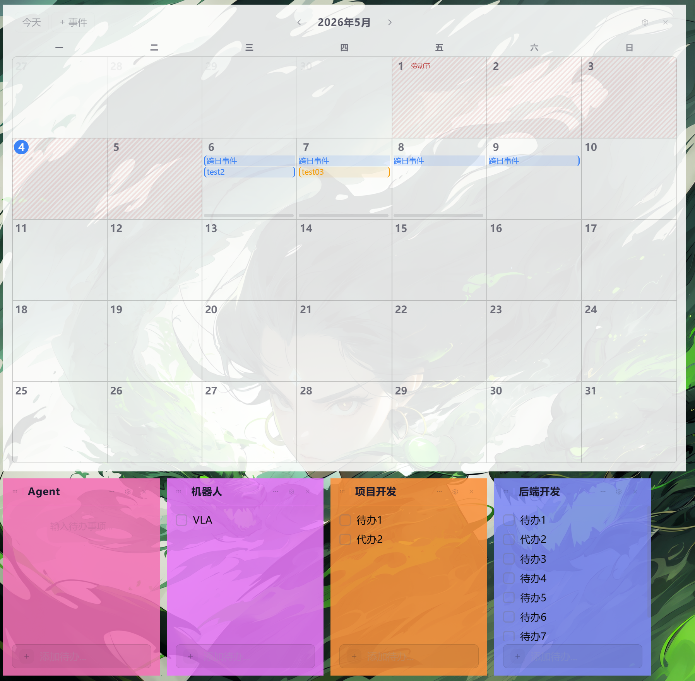
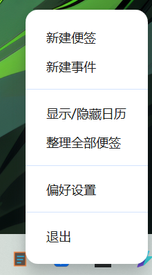

# OKNote

> 一款 Windows 桌面小组件应用 —— 日历事件管理 + 自由浮动便签，常驻后台，即用即走。
>
> 本项目由 [Qoder](https://qoder.com) 辅助开发。





## 功能特性

### 日历

- **月视图日历**：以周一为起始的月网格，支持月份前后翻页和年/月快速选择器
- **事件管理**：支持单日事件和多日事件，可设置起止时间、全天开关、8 种标签颜色、备注描述
- **中国法定节假日**：元旦、春节、清明节、劳动节、端午节、中秋节、国庆节自动标注（斜线阴影 + 节日名），2024-2030 年按官方公告精确标注，1900-2100 年间自动推算
- **农历日历**：内置农历转换算法（1900-2100），用于计算春节、端午、中秋等农历节日

### 便签
- **自由浮动窗口**：每张便签是独立的无边框透明窗口，可在桌面任意拖放
- **待办清单**：便签内嵌 checkbox 待办列表，支持勾选完成（划线标记）、行内编辑、删除
- **颜色标记**：16 种预设颜色可选，顶部色条区分不同便签
- **一键隐藏**：点击隐藏按钮最小化到系统托盘，不关闭数据
- **整理便签**：系统托盘菜单一键将所有便签窗口排列整齐

### 外观定制
- **深色 / 浅色主题**：一键切换，日历和便签独立跟随
- **全局字体**：支持选择系统已安装字体，统一应用到所有窗口
- **字号调节**：全局字号 + 日历 / 便签独立字号
- **背景颜色 & 透明度**：日历和便签各自独立设置背景色和窗口透明度
- **文字颜色**：独立设置文字颜色，日历单元格自动计算互补色边框
- **实时预览**：设置面板中的日历 / 便签预览区域即时反映外观变化

### 系统集成
- **系统托盘**：常驻托盘图标，右键菜单快速操作（新建便签、新建事件、显示/隐藏日历、整理便签、设置、退出）
- **开机自启**：可配置随系统启动自动运行
- **窗口记忆**：便签窗口位置自动保存，重启后恢复到上次关闭时的位置

---

## 技术栈

| 类别 | 技术 |
|------|------|
| 框架 | React 18 + TypeScript |
| 构建 | Vite 6 |
| 桌面 | Electron 41 |
| 状态管理 | Zustand 5 |
| 样式 | Tailwind CSS 3 + CSS Variables |
| 动画 | Framer Motion 11 |
| 图标 | Lucide React |
| 日期处理 | date-fns 4 |
| UI 基元 | Radix UI (Tooltip, Slot) |
| 打包 | electron-builder (NSIS) |

---

## 快速开始

### 环境要求

- Node.js >= 18
- npm >= 9
- Windows 10 / 11（桌面运行依赖 Electron）

### 安装与运行

```bash
# 克隆项目
git clone https://github.com/Zhujunjiforyou/OKNote.git
cd oknote

# 安装依赖
npm install

# 开发模式（浏览器，不含 Electron 功能）
npm run dev

# 开发模式（Electron 桌面运行）
npm run electron:dev

# 预览构建产物
npm run electron:preview

# 打包安装程序（输出到 release/）
npm run electron:build
```

---

## 使用指南

### 日历窗口

日历窗口是应用的主界面，启动时自动显示。

| 操作 | 方式 |
|------|------|
| 切换月份 | 点击标题栏左右箭头 `<` `>` |
| 快速跳转 | 点击标题栏中间的「2026年5月」弹出年/月选择面板 |
| 回到今天 | 点击「今天」按钮 |
| 选择日期 | 单击日历格 |
| 查看当日事件 | 双击日历格 |
| 新建事件 | 点击「+事件」按钮，或在日历格右键选择 |
| 编辑/删除事件 | 双击日历格后点击事件条目，弹出详情面板 |
| 多日事件 | 新建事件时开启「多日」开关，设置起止日期 |

### 便签窗口

| 操作 | 方式 |
|------|------|
| 新建便签 | 系统托盘菜单 →「新建便签」 |
| 编辑标题 | 点击标题文字进入编辑模式 |
| 改变颜色 | 点击标题栏色块，弹出 16 色选择器 |
| 添加待办 | 底部输入框输入后按 Enter |
| 勾选完成 | 点击待办前的 checkbox |
| 编辑待办 | 点击待办文字进入编辑模式 |
| 删除待办 | 鼠标悬停待办项，点击右侧删除按钮 |
| 隐藏便签 | 点击 … → 选择「隐藏」 |
| 删除便签 | 在设置→「管理」标签页中删除 |

### 设置窗口

通过日历窗口右上角齿轮图标或系统托盘菜单打开。

| 标签页 | 功能 |
|--------|------|
| **全局** | 深色/浅色主题切换、开机自启、全局字体选择、全局字号 |
| **日历** | 日历窗口的字体、字号、背景色、透明度、文字颜色（含预览） |
| **便签** | 便签窗口的字体、字号、背景色、透明度、文字颜色（含预览） |
| **管理** | 列出所有已保存的便签，可显示/隐藏/删除 |

---

## 项目结构

```
oknote/
├── electron/                   # Electron 主进程
│   ├── main.cjs                # 主进程入口：窗口管理、IPC、托盘、数据持久化
│   └── preload.cjs             # 预加载脚本：暴露 ElectronAPI 给渲染进程
├── src/
│   ├── main.tsx                # React 入口
│   ├── App.tsx                 # Hash 路由分发（/calendar, /note/:id, /settings）
│   ├── index.css               # Tailwind + CSS 变量 + 玻璃态样式
│   ├── components/
│   │   ├── calendar/           # 日历组件
│   │   │   ├── MonthGrid.tsx       # 月网格
│   │   │   ├── DayCell.tsx         # 单日单元格
│   │   │   ├── EventForm.tsx       # 事件编辑表单
│   │   │   ├── EventDetailModal.tsx # 事件详情弹窗
│   │   │   └── DayEventsModal.tsx  # 当日事件列表弹窗
│   │   ├── notes/              # 便签组件
│   │   │   └── TodoItem.tsx        # 待办事项条目
│   │   ├── ui/                 # 通用 UI 基元
│   │   │   ├── button.tsx          # shadcn 风格按钮
│   │   │   ├── card.tsx            # shadcn 风格卡片
│   │   │   └── tooltip.tsx         # Radix UI tooltip
│   │   └── windows/            # 窗口级组件
│   │       ├── CalendarWindow.tsx  # 日历窗口
│   │       ├── NoteWindow.tsx      # 便签窗口
│   │       └── SettingsWindow.tsx  # 设置窗口
│   ├── hooks/
│   │   └── useAppSettings.ts   # 设置同步 hook
│   ├── lib/
│   │   ├── holidays.ts         # 节假日数据 & 算法
│   │   ├── lunar-calendar.ts   # 农历转换（1900-2100）
│   │   └── utils.ts            # 工具函数（cn, generateId, 颜色计算）
│   ├── stores/
│   │   ├── app.store.ts        # 全局状态（dataReady）
│   │   ├── calendar.store.ts   # 日历状态（事件、日期导航）
│   │   └── notes.store.ts      # 便签状态（笔记、待办、倒计时）
│   └── types/
│       ├── calendar.types.ts   # 事件类型定义
│       ├── electron.d.ts       # Electron API 类型 + Window 扩展
│       └── notes.types.ts      # 便签、待办、倒计时类型定义
├── index.html                  # 入口 HTML
├── package.json                # 依赖、脚本、electron-builder 配置
├── vite.config.ts              # Vite 配置（React 插件、路径别名）
├── tailwind.config.ts          # Tailwind 主题配置
├── tsconfig.json               # TypeScript 引用配置
└── tsconfig.app.json           # TypeScript 编译配置
```

---

## 数据存储

所有数据以 JSON 文件形式存储在 Electron `userData` 目录下：

| 文件 | 内容 |
|------|------|
| `settings.json` | 主题模式、字体、颜色、透明度等所有设置 |
| `events.json` | 所有日历事件 |
| `note_{id}.json` | 每张便签独立存储（标题、颜色、待办列表） |
| `countdowns.json` | 倒计时数据 |
| `window-bounds.json` | 各窗口位置/大小记忆 |

数据写入采用 300ms 防抖 + 原子写入（.tmp 重命名），避免频繁 I/O 和写入中断。

---

## License

MIT

---

<p align="center">Made with ❤️ for Windows desktop</p>
