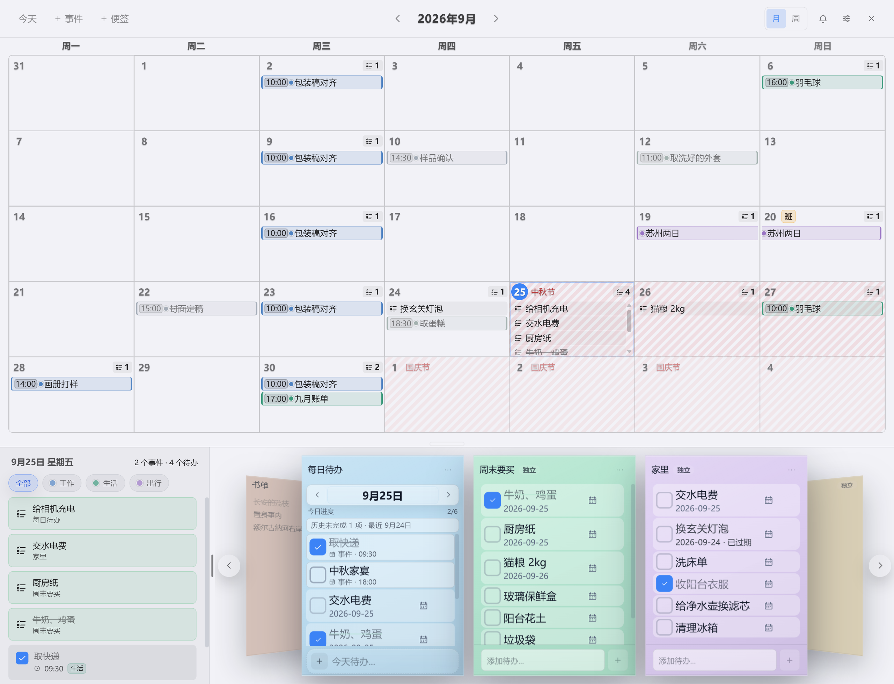
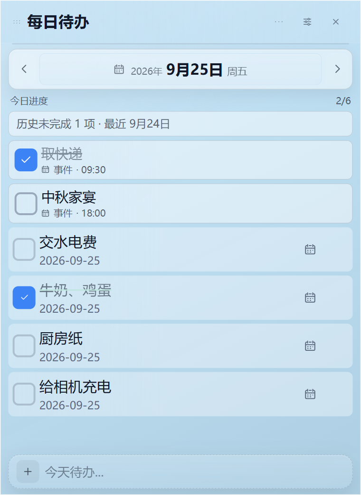
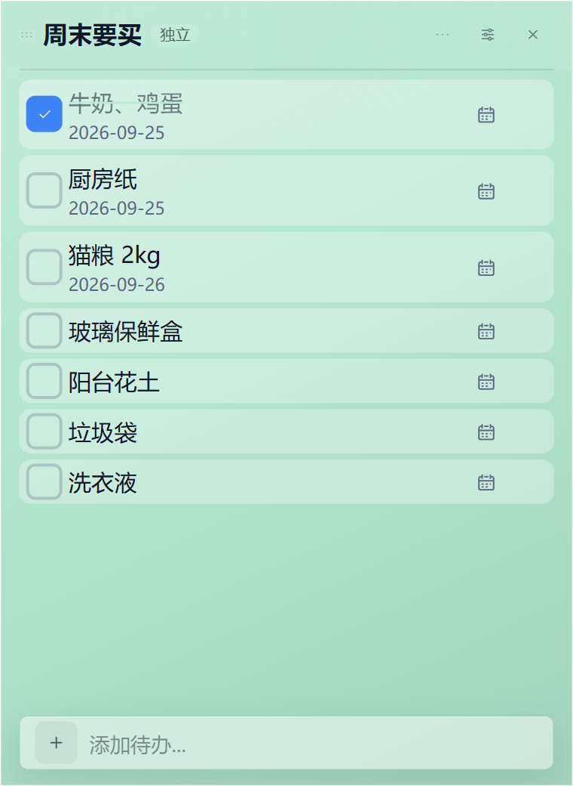
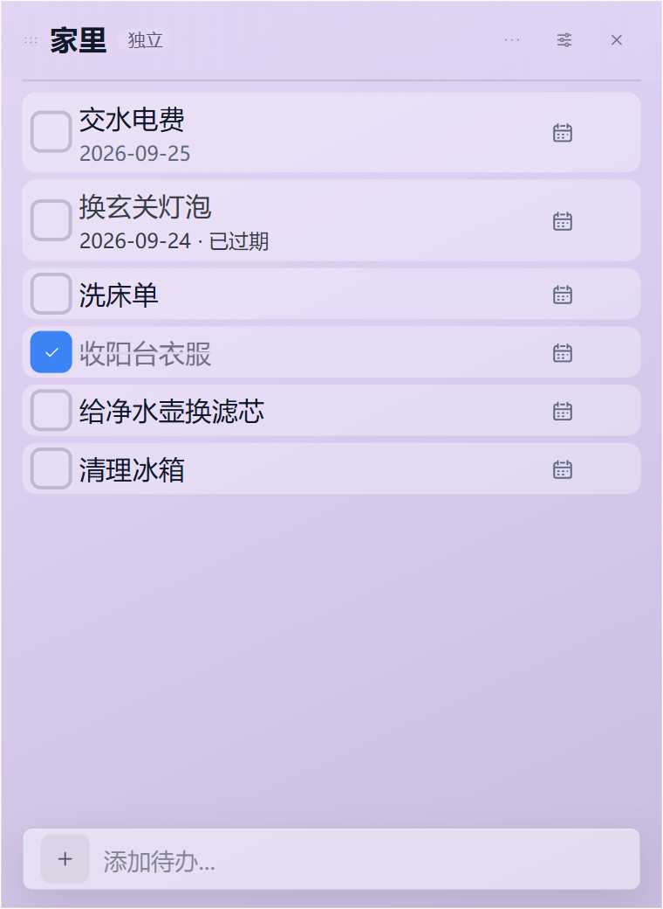
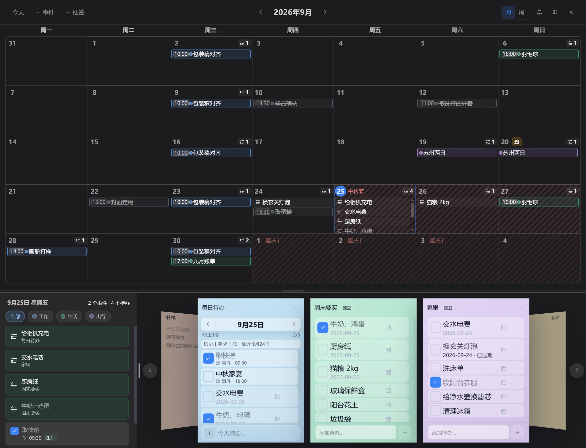
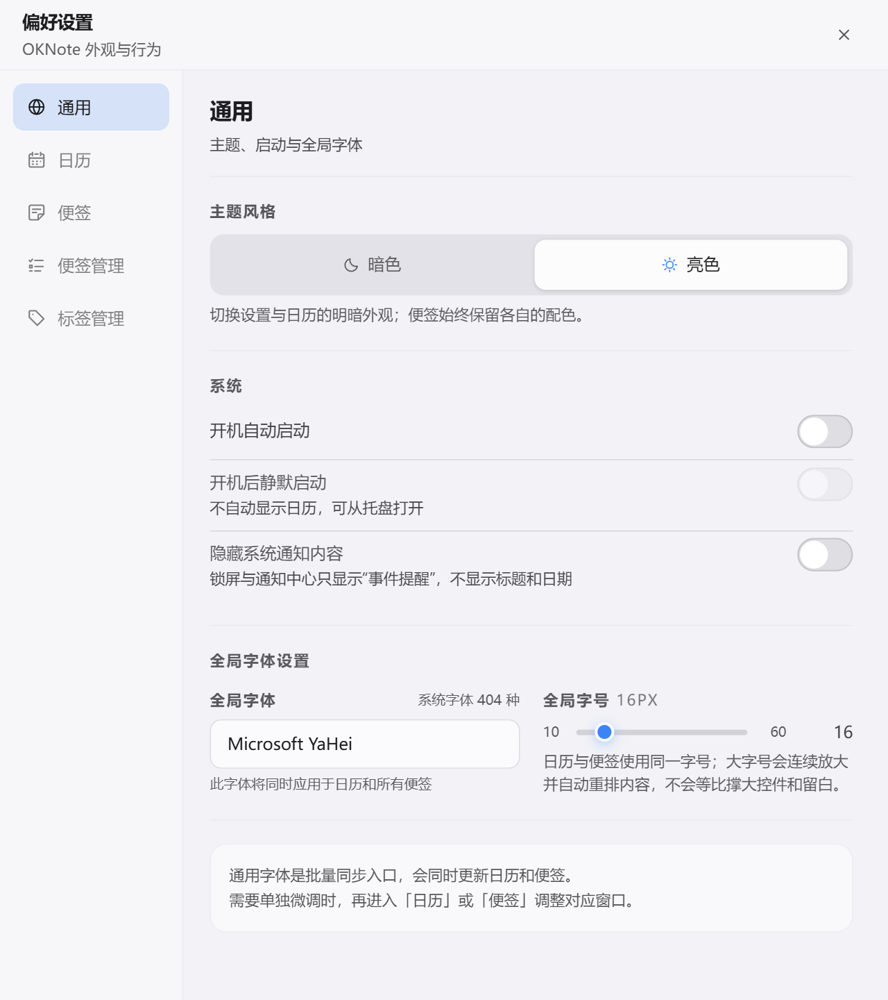

# OKNote

OKNote 是一款桌面日历与便签应用，支持日程安排、待办清单和日常记录。半透明窗口可按喜好调整配色，便签既可独立摆放，也可挂载到日历下方集中浏览。

当前版本：**2.3.0** · Windows 10 / 11 · macOS 13+

## 下载与安装

| 系统 | 安装包 |
| --- | --- |
| Windows 10 / 11（x64） | [下载 EXE](https://github.com/Zhujunjiforyou/OKNote/releases/download/v2.3.0/OKNote-2.3.0-win-x64.exe) |
| macOS 13+（Apple 芯片） | [下载 DMG](https://github.com/Zhujunjiforyou/OKNote/releases/download/v2.3.0/OKNote-2.3.0-mac-arm64.dmg) |
| macOS 13+（Intel） | [下载 DMG](https://github.com/Zhujunjiforyou/OKNote/releases/download/v2.3.0/OKNote-2.3.0-mac-x64.dmg) |

Windows 运行安装程序；Mac 打开 DMG 后将 OKNote 拖入“应用程序”。macOS 安装包使用临时签名，尚未经过 Apple 公证。

## 界面预览

### 日历与挂载便签



### 每日待办与独立便签

| 每日待办 | 购物清单 | 家中待办 |
| --- | --- | --- |
|  |  |  |

### 暗色日历



### 设置窗口



## 功能特性

### 日历

- **月/周视图**：以周一为起始日，支持月视图、周视图、月份前后切换和年月快速跳转。
- **事件管理**：支持单日事件、跨日事件、时间段、全天事件、备注和删除。
- **完成状态**：事件与待办均可完成、恢复，完成后保留划线记录并退出未完成计数。循环事件只完成选中的一次；跨日事件共享完成状态。已完成事件不再触发本次提醒，历史提醒记录保留。
- **循环事件**：支持按天、按周、按月、按年循环，可设置间隔、星期、月内日期和结束日期，并会在月视图、周视图、固定区和视图便签中展开显示。
- **事件提醒**：支持准时、提前分钟/小时/天提醒，可选提示音；优先使用系统通知，并保留可查看、可标记已读的提醒记录。可在设置中隐藏锁屏/通知中心里的事件标题与日期。
- **事件标签**：可在设置中维护标签名称和颜色，日历、固定区和视图便签会同步使用标签。
- **文字颜色**：根据背景自动调整事件文字颜色，也可以在设置中自行指定。
- **中国法定节假日**：标注 2024–2026 年的法定放假与调休安排。
- **农历日期**：内置 1900-2100 年农历换算，用于春节、端午、中秋等节日计算。
- **未完成计数**：日期格右上角显示当日已排期待办与事件（含单日、跨日和循环事件）的未完成数量，点击打开对应日期的每日待办。
- **字号调整**：支持 10–60 的字号。大字号时会调整排版，日历中放不下的内容可以滚动查看。
- **小窗口布局**：窗口缩小时自动切到周视图、收起挂载区，保留日期和事项计数。
- **贴边自动收起**：把日历移到屏幕边缘可以自动收起，鼠标移过去时展开。
- **可调挂载区**：拖动日历下方的分隔条可以调整高度，重启后仍会保留。也可以在设置中隐藏这块区域，只显示日历。
- **左右宽度**：拖动事项回显与挂载便签之间的竖向分隔条，调整两侧宽度；重启后保留，窗口缩小时自动限制到可用范围。

### 便签

- **独立便签**：每张便签都是独立透明窗口，可在桌面自由拖动，并可编辑标题、颜色和待办；全局不透明度在设置中统一调整。
- **待办排期**：普通便签中的待办可安排到日历，也可改期或移出日历。原便签、日程清单和每日待办同步更新；过期未完成项使用灰色文字。
- **当日日程**：双击日期格，按待办和事件分组查看、勾选；待办可直接编辑、改期或删除，事件可打开详情。普通待办可点击来源名称打开原便签。
- **视图便签**：创建时必须绑定标签，按指定标签回显日历事件，并支持从便签中新增、编辑和删除对应事件；同一标签只保留一个视图便签。
- **每日待办便签**：全局只保留一张，按日期汇总所有便签的已排期待办与当天事件；支持勾选完成、前后日期切换、回到今天、手动输入日期、当日进度和历史未完成提示。
- **日历挂载**：便签可拖入日历下方挂载区，变成日历的一部分；隐藏后重新显示会保留挂载状态。
- **当日回显**：日历左下角显示选中日期的待办和事件，支持事件标签筛选及倒计时。点击事项进入详情或来源便签，事件可勾选完成。
- **挂载便签切换**：左右两侧显示立体候选卡片，点击候选卡片或左右按钮循环切换；切换和缩放时保留正在输入的草稿。
- **待办清单**：点击文字编辑，完成后勾选；删除的待办可以撤销。
- **便签配色**：每张便签可以单独选颜色，切换日历主题不会改变便签配色。

### 设置与管理

- **外观设置**：可选择浅色或深色主题，调整字体、字号、日历背景和文字颜色、窗口透明度。日历和便签也可以分别设置。
- **便签管理**：集中查看所有便签，支持显示、隐藏、整理桌面位置和移入回收站；回收站中的便签可以恢复或永久删除。
- **标签管理**：维护事件标签，标签删除后会同步清理事件引用。
- **开机自启**：可配置随系统启动，并可选择开机后静默启动。

### 系统集成

- **系统托盘**：常驻托盘图标，右键菜单支持新建便签、新建事件、显示/隐藏日历、整理便签、打开设置和退出。
- **macOS 菜单**：提供关于、偏好设置、编辑和窗口菜单，支持 `Command+,` 打开设置、`Command+W` 关闭当前窗口、`Command+Q` 退出及系统编辑快捷键。
- **窗口记忆**：重启后保留便签的位置、大小、透明度和挂载状态，以及日历挂载区的高度。
- **窗口位置恢复**：更换分辨率或显示器后，会把屏幕外的窗口移回可见位置。
- **安装位置**：Windows 安装程序支持由用户选择程序安装目录。
- **本地保存**：日程、便签和设置保存在当前用户的应用数据目录中，与程序安装目录分开。
- **旧数据兼容**：升级后可以继续使用原有数据。读取失败时会提示并保留文件，不会直接清空。

## 构建

### Windows

```bash
npm ci
npm run electron:build
```

安装程序输出到 `release/2.3.0/OKNote-2.3.0-win-x64.exe`。

### macOS

在 Mac 上安装 Node.js 22.12+ 和 Xcode Command Line Tools，然后在源码目录运行：

```bash
xcode-select --install
bash scripts/build-macos-local.command
```

脚本会安装依赖并生成当前芯片的 DMG。添加 `all` 可同时构建 Apple 芯片和 Intel 版本：

```bash
bash scripts/build-macos-local.command all
```

安装包位于 `release/2.3.0/`。打开 DMG，将 OKNote 拖到“应用程序”。本地构建使用临时签名；正式分发需要配置 Developer ID 签名和公证。

## 技术栈

| 类别 | 技术 |
| --- | --- |
| 框架 | React 18 + TypeScript |
| 构建 | Vite 6 |
| 桌面 | Electron 44 |
| 状态管理 | Zustand 5 |
| 样式 | Tailwind CSS 3 + CSS Variables |
| 动画 | Framer Motion 11 + CSS transition |
| 图标 | OKNote SVG 线性图标、PNG / ICO / ICNS |
| 日期处理 | date-fns 4 |
| 打包 | electron-builder NSIS / DMG |

## 快速开始

### 环境要求

- Node.js >= 22.12
- npm >= 9
- Windows 10 / 11；macOS 13+
- Mac 编译原生窗口模块需要 Xcode Command Line Tools（`xcode-select --install`）

### 安装与运行

```bash
git clone https://github.com/Zhujunjiforyou/OKNote.git
cd OKNote

npm ci

# 浏览器预览，修改不会保存到本地文件
npm run dev

# Electron 桌面开发模式
npm run electron:dev

# 预览构建产物
npm run electron:preview

# 打包 Windows 安装程序，输出到 release/<当前版本>/
npm run electron:build
```

常用检查命令：

```bash
npm run lint
npm test
npm run build
node --check electron/main.cjs
```

## 使用指南

### 日历窗口

| 操作 | 方式 |
| --- | --- |
| 切换月份 | 点击标题栏左右箭头 |
| 快速跳转 | 点击标题栏中间的年月 |
| 回到今天 | 点击「今天」 |
| 新建事件 | 点击「+ 事件」，或在日期格右键选择 |
| 查看当天待办与事件 | 双击日期格，或日期格获得焦点后按 Enter |
| 打开对应日期的每日待办 | 点击日期格右上角未完成数字 |
| 完成/恢复事件 | 在事件详情、当日日程、每日待办或回显列表中点击勾选框 |
| 编辑/删除事件 | 点击事件后在详情或编辑面板中操作 |
| 调整挂载区高度 | 拖动日历与下方区域之间的小横条 |
| 调整回显与挂载区宽度 | 拖动两侧之间的竖向分隔条 |
| 切换月/周视图 | 右上角「月 / 周」切换 |

### 便签窗口

| 操作 | 方式 |
| --- | --- |
| 新建独立便签 | 托盘菜单或日历「+ 便签」菜单 |
| 新建视图便签 | 日历「+ 便签」菜单中选择标签 |
| 编辑标题 | 双击便签标题 |
| 添加待办 | 独立便签底部输入内容后回车 |
| 安排待办日期 | 点击待办行的日历图标，选择日期后确认 |
| 待办改期/取消排期 | 点击日期或日历图标；普通便签待办可选择“移出日历” |
| 编辑事件 | 在视图便签中点击事件，打开外部编辑面板 |
| 挂载到日历 | 将独立便签拖到日历右下挂载区域 |
| 取消挂载 | 在挂载便签菜单中选择取消挂载 |
| 隐藏/显示 | 通过便签菜单或设置页便签管理操作 |

### 设置窗口

| 标签页 | 功能 |
| --- | --- |
| 通用 | 主题、开机自启、全局字体和字号 |
| 日历 | 贴边自动收起、底部区域显隐、字体、字号、背景、透明度、文字和预览 |
| 便签 | 便签字体、字号和整体不透明度；单张便签颜色在便签菜单中调整 |
| 便签管理 | 便签显示/隐藏/整理/移入回收站，以及恢复和永久删除 |
| 标签管理 | 新增、编辑、删除事件标签 |

## 数据存储

Windows 默认数据目录为 `%APPDATA%\oknote`，macOS 为 `~/Library/Application Support/oknote`。日程和便签放在其中的 `data` 文件夹，设置和窗口位置单独保存：

| 文件 | 内容 |
| --- | --- |
| `settings.json` | 主题、字体、颜色、透明度、开机自启等设置 |
| `data/events.json` | 所有日历事件 |
| `data/tags.json` | 事件标签 |
| `data/note_{id}.json` | 每张便签的标题、强调色、内容、挂载状态和隐藏状态 |
| `window-bounds.json` | 窗口位置、大小和贴边状态 |
| `data/reminder-state.json` | 已触发提醒记录，用于避免重复提醒 |
| `data/reminder-history.json` | 提醒历史和未读状态 |
| `data/.trash/` | 可从“便签管理”恢复的回收站记录 |

修改会自动保存，上一份文件保留为 `.bak`。文件缺失或损坏时会尝试读取备份。如果仍无法恢复，会提示错误并保留原文件；文件暂时不能写入时，不会继续覆盖数据。

部分旧 Windows 版本把数据放在安装目录旁的 `user-data` 文件夹。升级时会先备份，再自动复制到当前用户的数据目录，不覆盖已有文件。已经导入过的旧目录不会反复导入，避免删除的便签重新出现。正常升级不需要手动搬文件。

## 更新日志

### V2.3.0 - 2026-09-25

- 新增 macOS 支持，提供 Apple 芯片和 Intel 的 DMG 构建，适配桌面窗口、菜单栏、Dock、系统菜单和编辑快捷键。
- 事件支持标记完成和恢复，完成后划线显示、退出未完成计数，并停止对应提醒。循环事件按次完成，跨日事件共享完成状态。
- 普通便签待办可设置日期、改期或移出日历，在原便签、日历和每日待办中同步更新；过期未完成待办使用灰色文字。
- 每日待办汇总当日已排期的便签待办及单日、跨日、循环事件，进度和历史未完成提示覆盖普通便签。
- 修复新建普通事件未计入日期格右上角数量的问题。
- 修复双击日期遗漏待办的问题，当日日程支持直接编辑、完成、改期和删除待办，也可打开来源便签。
- 调整当日日程的标题、分组、事项、时间和标签排版，去掉每条待办下重复的操作说明。
- 回显与挂载区之间增加宽度分隔条，支持拖动、键盘调整和重启后的宽度恢复。
- 修复挂载轮播只显示一侧候选的问题，左右均可循环切换；改善切换和缩放时的输入草稿保留。
- 修复窄窗口下日期与计数换行、大字号下事件正文重叠的问题。
- 减少待办行控件占用，修复日期和过期状态过早换行、左下角标签提前省略的问题。
- 设置页随窗口大小调整分类、控件排列和间距，修复缩小时的内容裁切。
- 调淡节假日背景斜纹，减少对事项文字的干扰。
- 更新手绘 OK 日历应用图标及界面线条图标，修复 Windows 通知显示默认图标和 Electron 名称的问题。
- 修复应用启动阶段的提醒处理，补充通知投递失败或缺少回调时的备用提醒。
- 修复 Windows 覆盖安装时用户选择的安装目录可能异常的问题。
- 修复 Mac 显示桌面后日历被收起、点击便签唤回其他窗口、挂载便签拖出后松手卡住及预览残留的问题。
- 修复 Mac 从 Dock、菜单栏命令或系统通知打开日历时被其他应用遮挡的问题；切换到其他应用后恢复桌面层。
- Mac 支持 Command+W 关闭窗口、Command+Q 退出、Command+, 打开设置；设置窗口切换应用后正常被遮住。
- Mac 登录启动读取系统实际状态，支持待批准提示；用户从系统登录项移除后，重启应用不再自动重新添加。
- Mac 设置与提醒记录增加系统通知权限、横幅设置状态提示；字体列表过滤内部名称。
- 减少日历与待办列表的重复渲染，优化输入聚焦和区域拖动，改善跨窗口保存时的内容同步。
- Electron 升级到 44.3.0，更新构建依赖；Mac 最低系统要求为 macOS 13。

### V2.2.1 - 2026-09-05

- 修复便签挂载后继续编辑时无法保存的问题。
- 修复损坏的提醒记录导致日历打不开、异常事件导致其他提醒也失效的问题。
- 完善备份恢复。设置、标签或便签文件损坏时，不再直接用空数据覆盖；备份可以读取但暂时无法写回时，仍能查看内容。
- 升级时保留旧版数据，修复更换安装目录可能丢失数据、重复导入旧便签的问题。
- 隐藏便签前检查未保存的输入，取消隐藏后保留窗口和草稿。
- 修复中文输入法选词时按回车，意外保存标题或新增待办的问题。
- 修复 2100 年末事件不显示，以及每日待办保存越界日期后无法找到的问题。
- 修复删除标签后筛选失效、部分事件无法编辑或删除的问题。
- 修复小窗口下菜单和日期选择器被裁切、按 Tab 后焦点丢失的问题；便签标题支持空格、Enter 和 F2 编辑。
- 改善浅色设置文字和暗色跨月日期的可读性，减少大量循环提醒对主进程的占用。
- 区分日历中的待办和事件，缩小日期格右上角的未完成数量标记。
- 修复正面挂载便签文字发糊的问题，保留轮播动画和两侧倾斜预览。
- 修复安装包缺少语言资源导致新建事件时崩溃的问题，打包时检查必要运行文件。
- 整理部分重复代码，并补充保存失败、旧数据升级和常用操作的测试。

### V2.2.0 - 2026-08-26

- 年月选择支持直接输入年份和横向拖动年份列表，年份范围为 1900–2100；修正节假日、跨午夜日期刷新和日期格事件显示。
- 全局与独立字号范围调整为 10–60。大字号会重新安排日历和便签内容，但不会把输入框、按钮和空白区域一起等比放大；恢复普通字号时布局也会同步恢复。
- 每日待办只保留一张，支持显示完整日期、手动切换日期、查看历史未完成项，并可逐次完成当天的循环事件。
- 标签视图便签创建时直接绑定标签，同一标签只保留一个窗口；标签改名、事件增删和循环事件会同步更新。
- 日历底部的当日视图与挂载区可以隐藏或调整高度；恢复贴边自动收起和桌面便签整理，并改善挂载轮播与收展动画。
- 便签继续使用各自的配色，主题切换只影响日历和设置；精简便签上的背景装饰和无意义图标，并降低圆角和空白占用。
- 便签管理增加回收站、恢复和永久删除；待办删除后可以撤销。
- 提醒增加记录与未读状态，可选择隐藏系统通知中的事件内容；修复提醒窗口无法关闭和重复提醒。
- 事件表单支持同日开始/结束时间，时间输入区域可以直接点击；循环事件详情会明确说明编辑或删除的是整个系列。
- 修复便签关闭重开、回收站恢复、挂载切换和多个窗口同时编辑时可能丢失最新内容的问题；数据无法读取或写入时会在界面提示。
- 修复弹窗点击外部不关闭、Esc 行为不一致、标题编辑入口不清楚、部分控件难以点击及键盘无法打开日历事件等问题。
- 安装程序支持选择安装位置，卸载时保留用户数据；业务数据与程序安装目录分开保存。

### V2.1.0 - 2026-05-08

- 新增循环事件：事件表单支持按天、周、月、年重复，包含间隔、星期、月内日期和结束日期；日历网格、详情弹窗、固定区和视图便签会识别并展示循环实例。
- 新增事件提醒：事件可设置准时或提前提醒，支持提示音；主进程定时扫描事件并弹出置顶提醒窗口，同时记录已触发状态避免重复弹出。
- 新增每日待办便签：新增 `daily` 类型便签和专用待办面板，可按日期记录待办、查看进度、回看历史未完成项，并在日历日期格显示未完成数量。
- 优化便签体验：独立便签、视图便签和每日待办拥有更明确的视觉区分，挂载轮播支持定位并高亮指定便签，待办列表和输入区的可读性更稳定。
- 优化小屏适配：日历窗口会根据宽高计算显示密度，动态缩放字体、收纳标题栏按钮、压缩工具区和固定区宽度，并按小窗口限制挂载区高度，低分辨率下不再挤压主要内容。
- 优化日历布局：标题栏改为三列测量布局，年月跳转时固定到月初避免日期溢出；视图事件列表新增循环标识和临近开始/截止状态。
- 优化系统集成：窗口恢复时自动校正到可见屏幕区域，贴边收起高度和停留判定更细，托盘菜单新增每日待办入口。
- 优化安装与数据目录：安装程序支持选择程序安装目录；业务数据默认存放在当前用户的 Electron `userData/data/`，与程序安装目录分离。
- 统一视觉体系：默认深浅色、事件/便签/标签色板和多处玻璃质感样式统一更新，减少旧版高饱和色块带来的割裂感。

## License

MIT

---

<p align="center">Windows · macOS</p>
